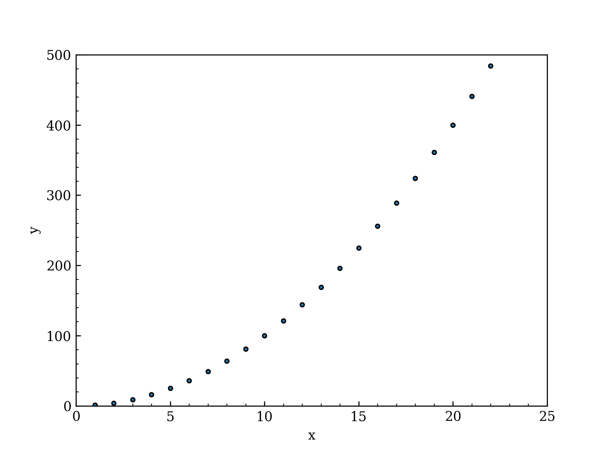
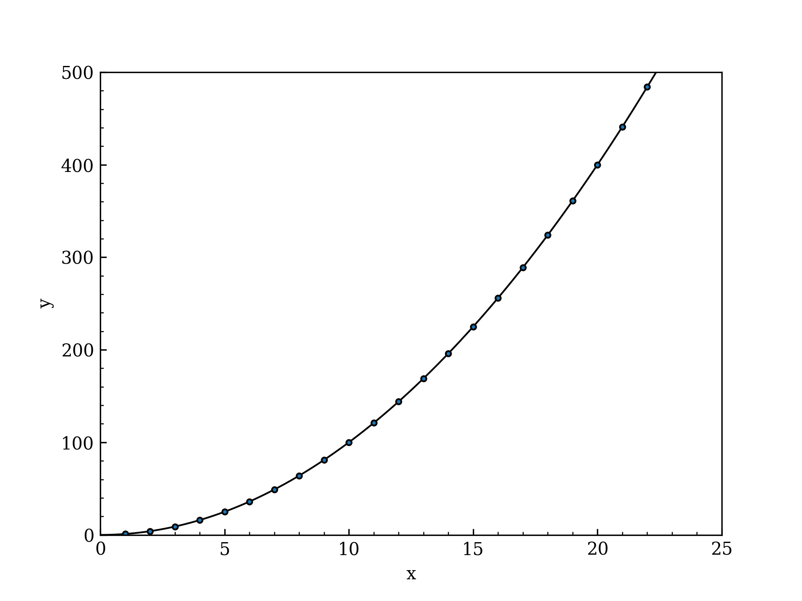

# グラフのプロット
## 参考にしたもの：
[謁見レポート用グラフをPythonで描く](https://note.com/js2fzh/n/n4ebe87a23c8a)
グラフはpythonでcsvファイルを読み込んでpngにしている.
出力をCSVファイル形式にしてそれをpythonで書き出す。
参考にしたもの：[謁見レポート用グラフをPythonで描く](https://note.com/js2fzh/n/n4ebe87a23c8a)
仮想環境のコマンド

```
source venv/bin/activate
```
 始め

```
deactivate
```
 終わり


<details><summary>1つ目のプログラム</summary>

```
import matplotlib.pyplot as plt
import pandas as pd

#フォント設定
plt.rcParams['font.family'] = 'DejaVu Serif' # font familyの設定 DejaVu Serif,Liberation Serif ->Times New Romanの代わりに
#plt.rcParams['mathtext.fontset'] = 'stix' # math fontの設定
plt.rcParams["font.size"] = 10 # 全体のフォントサイズが変更されます。
#plt.rcParams['xtick.labelsize'] = 9 # 軸だけ変更されます。
#plt.rcParams['ytick.labelsize'] = 24 # 軸だけ変更されます


#軸設定
plt.rcParams['xtick.direction'] = 'in' #x軸の目盛りの向き
plt.rcParams['ytick.direction'] = 'in' #y軸の目盛りの向き
#plt.rcParams['axes.grid'] = True # グリッドの作成
#plt.rcParams['grid.linestyle']='--' #グリッドの線種
plt.rcParams["xtick.minor.visible"] = True  #x軸補助目盛りの追加
plt.rcParams["ytick.minor.visible"] = True  #y軸補助目盛りの追加
#plt.rcParams['xtick.top'] = True  #x軸の上部目盛り
#plt.rcParams['ytick.right'] = True  #y軸の右部目盛り


#軸大きさ
#plt.rcParams["xtick.major.width"] = 1.0             #x軸主目盛り線の線幅
#plt.rcParams["ytick.major.width"] = 1.0             #y軸主目盛り線の線幅
#plt.rcParams["xtick.minor.width"] = 1.0             #x軸補助目盛り線の線幅
#plt.rcParams["ytick.minor.width"] = 1.0             #y軸補助目盛り線の線幅
#plt.rcParams["xtick.major.size"] = 10               #x軸主目盛り線の長さ
#plt.rcParams["ytick.major.size"] = 10               #y軸主目盛り線の長さ
#plt.rcParams["xtick.minor.size"] = 5                #x軸補助目盛り線の長さ
#plt.rcParams["ytick.minor.size"] = 5                #y軸補助目盛り線の長さ
#plt.rcParams["axes.linewidth"] = 1.0                #囲みの太さ


#凡例設定
plt.rcParams["legend.fancybox"] = False  # 丸角OFF
plt.rcParams["legend.framealpha"] = 1  # 透明度の指定、0で塗りつぶしなし
plt.rcParams["legend.edgecolor"] = 'black'  # edgeの色を変更
plt.rcParams["legend.markerscale"] = 5 #markerサイズの倍率
plt.rcParams['lines.linewidth'] = 0
plt.rcParams['lines.linestyle'] = ''
plt.rcParams['lines.marker'] = '.'

input_csv = pd.read_csv('./input_csv_file.csv', header=None)    #********使用するcsvファイルの指定********
first_column_data = input_csv[0]
second_column_data = input_csv[1]

plt.xlim(0, 25)     #********x軸の範囲(最小値,最大値)********
plt.ylim(0, 500)    #********y軸の範囲(最小値,最大値)********

#plt.figure(dpi=300)
plt.plot(first_column_data, second_column_data, markeredgecolor='k')
plt.xlabel("x")     #********x軸ラベルの指定********
plt.ylabel("y")     #********y軸ラベルの指定********
#plt.legend()

#plt.show()
plt.savefig('my_plot.png', dpi=300) # ← この行を追加します。'my_plot.png'という名前で保存されます。

print("グラフを 'my_plot.png' として保存しました。")
```

</details>

結果


## 2つ目(近似曲線を入れる)
無理やり合わせにいった。
<details><summary>2つ目のプログラム</summary>

```
import matplotlib.pyplot as plt
import pandas as pd
import numpy as np

#フォント設定
plt.rcParams['font.family'] = 'DejaVu Serif' # font familyの設定 DejaVu Serif,Liberation Serif ->Times New Romanの代わりに
#plt.rcParams['mathtext.fontset'] = 'stix' # math fontの設定
plt.rcParams["font.size"] = 10 # 全体のフォントサイズが変更されます。
#plt.rcParams['xtick.labelsize'] = 9 # 軸だけ変更されます。
#plt.rcParams['ytick.labelsize'] = 24 # 軸だけ変更されます


#軸設定
plt.rcParams['xtick.direction'] = 'in' #x軸の目盛りの向き
plt.rcParams['ytick.direction'] = 'in' #y軸の目盛りの向き
#plt.rcParams['axes.grid'] = True # グリッドの作成
#plt.rcParams['grid.linestyle']='--' #グリッドの線種
plt.rcParams["xtick.minor.visible"] = True  #x軸補助目盛りの追加
plt.rcParams["ytick.minor.visible"] = True  #y軸補助目盛りの追加
#plt.rcParams['xtick.top'] = True  #x軸の上部目盛り
#plt.rcParams['ytick.right'] = True  #y軸の右部目盛り


#軸大きさ
#plt.rcParams["xtick.major.width"] = 1.0             #x軸主目盛り線の線幅
#plt.rcParams["ytick.major.width"] = 1.0             #y軸主目盛り線の線幅
#plt.rcParams["xtick.minor.width"] = 1.0             #x軸補助目盛り線の線幅
#plt.rcParams["ytick.minor.width"] = 1.0             #y軸補助目盛り線の線幅
#plt.rcParams["xtick.major.size"] = 10               #x軸主目盛り線の長さ
#plt.rcParams["ytick.major.size"] = 10               #y軸主目盛り線の長さ
#plt.rcParams["xtick.minor.size"] = 5                #x軸補助目盛り線の長さ
#plt.rcParams["ytick.minor.size"] = 5                #y軸補助目盛り線の長さ
#plt.rcParams["axes.linewidth"] = 1.0                #囲みの太さ


#凡例設定
plt.rcParams["legend.fancybox"] = False  # 丸角OFF
plt.rcParams["legend.framealpha"] = 1  # 透明度の指定、0で塗りつぶしなし
plt.rcParams["legend.edgecolor"] = 'black'  # edgeの色を変更
plt.rcParams["legend.markerscale"] = 5 #markerサイズの倍率
plt.rcParams['lines.linewidth'] = 0
plt.rcParams['lines.linestyle'] = ''
plt.rcParams['lines.marker'] = '.'

input_csv = pd.read_csv('./input_csv_file.csv', header=None)    #********使用するcsvファイルの指定********
first_column_data = input_csv[0]
second_column_data = input_csv[1]


plt.xlim(0, 25)     #********x軸の範囲(最小値,最大値)********
plt.ylim(0, 500)    #********y軸の範囲(最小値,最大値)********

#近似曲線の追加
x_smooth = np.arange(0, 25, 0.1) 

# ステップ2：yの値を計算
y_smooth = x_smooth * x_smooth

# ステップ3：マーカーなしの「線」でプロットする
# linewidthは1.0くらいが標準で見やすい太さです
plt.plot(x_smooth, y_smooth, '-', linewidth=1.0, color='black')


#plt.figure(dpi=300)
plt.plot(first_column_data, second_column_data, markeredgecolor='k')
plt.xlabel("x")     #********x軸ラベルの指定********
plt.ylabel("y")     #********y軸ラベルの指定********
#plt.legend()

#plt.show()
plt.savefig('my_plot2.png', dpi=300) # ← この行を追加します。'my_plot.png'という名前で保存されます。

print("グラフを 'my_plot2.png' として保存しました。")
```
</details>

画像2
