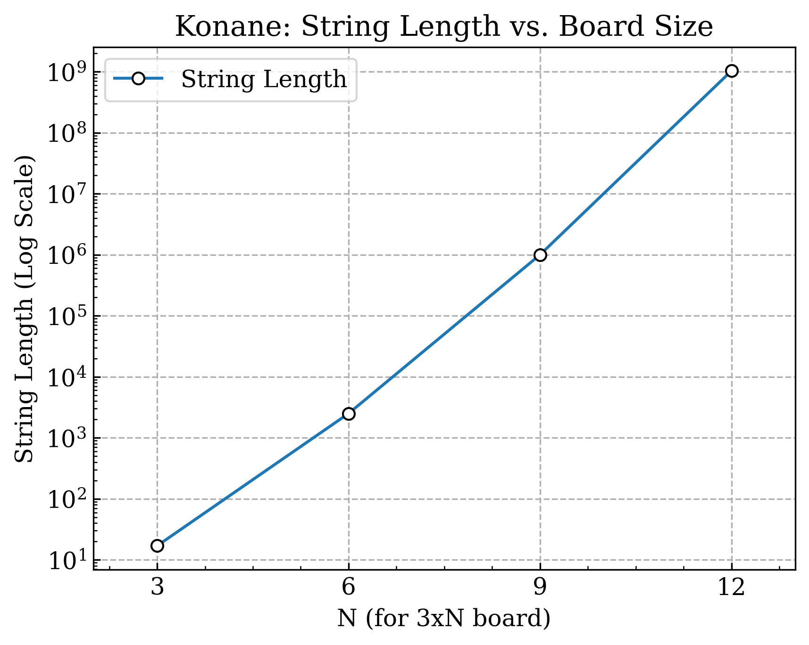

<script type="text/javascript" async src="https://cdnjs.cloudflare.com/ajax/libs/mathjax/3.2.2/es5/tex-mml-chtml.min.js">
</script>
<script type="text/x-mathjax-config">
 MathJax.Hub.Config({
 tex2jax: {
 inlineMath: [['$', '$'] ],
 displayMath: [ ['$$','$$'], ["\\[","\\]"] ]
 }
 });
</script>
[](
数式の追加
)


# 第4回の資料
## やったこと
- GitHub で開発することにした
- pythonでグラフをプロンプトできるようにした
- 教科書の内容に関するコードを書いた


## 実施したこと
- 版面を{},|,0を用いた文字列に変換する
- 版面を読み込んで局面の値を求める　
- n*nマスの最長の文字列はどんなときか

[](
　版面と文字列の長さの関係がわかったら面白いかも(版面の値を見るときに文字列を見ながら確認するから)
)


## 版面を読み込んで局面の値を求める

<details><summary>文字列変換のプログラム</summary>

```
#include <bits/stdc++.h>
using namespace std;
map<vector<string>, string> memo;
string generate_game_string(const vector<string>& board);


string join(const set<string>& s) {
    if (s.empty()) {
        return ""; //何もなかったら何も出さないということ
    }
    stringstream ss;
    for (auto it = s.begin(); it != s.end(); ++it) {
        if (it != s.begin()) {
            ss << ",";
        }
        ss << *it;
    }
    return ss.str();
}


string generate_game_string(const vector<string>& board) {
   
    if (memo.count(board)) { //メモ化再帰
        return memo[board];
    }

    int rows = board.size();
    if (rows == 0) return "0"; //{|}->0にした
    int cols = board[0].size();

    // 左右のプレイヤーの選択肢を格納する
    set<string> left_options;  // 黒 'B' の手
    set<string> right_options; // 白 'W' の手

    // 移動方向 (上, 下, 左, 右)
    int dr[] = {-1, 1, 0, 0};
    int dc[] = {0, 0, -1, 1};

    // 2. 盤面全体を探索し、すべての可能な手を探す
    for (int r = 0; r < rows; ++r) {
        for (int c = 0; c < cols; ++c) {
            // --- 左プレイヤー (黒 'B') の手を探す ---
            if (board[r][c] == 'B') {
                for (int i = 0; i < 4; ++i) {
                    int jump_over_r = r + dr[i];
                    int jump_over_c = c + dc[i];
                    int land_on_r = r + 2 * dr[i];
                    int land_on_c = c + 2 * dc[i];

                    // ジャンプ可能かチェック
                    if (0 <= land_on_r  && land_on_r < rows && 0 <= land_on_c && land_on_c < cols &&
                        board[jump_over_r][jump_over_c] == 'W' && board[land_on_r][land_on_c] == '.') {
                        
                        vector<string> next_board = board;
                        int cur_r = r, cur_c = c;
                        // 連続ジャンプの処理
                        while (0 <= cur_r + 2 * dr[i]  && cur_r + 2 * dr[i] < rows &&
                               0 <= cur_c + 2 * dc[i]  && cur_c + 2 * dc[i] < cols &&
                               next_board[cur_r + dr[i]][cur_c + dc[i]] == 'W' &&
                               next_board[cur_r + 2 * dr[i]][cur_c + 2 * dc[i]] == '.') {
                            
                            next_board[cur_r][cur_c] = '.';
                            next_board[cur_r + dr[i]][cur_c + dc[i]] = '.'; // 飛び越えられた駒を消す
                            cur_r += 2 * dr[i];
                            cur_c += 2 * dc[i];
                            next_board[cur_r][cur_c] = 'B';
                        left_options.insert(generate_game_string(next_board));// 再帰呼び出し
                        }
                       
                    }
                }
            }
            // 右プレイヤー (白 'W') の手を探す 
            else if (board[r][c] == 'W') {
                for (int i = 0; i < 4; ++i) {
                     int jump_over_r = r + dr[i];
                    int jump_over_c = c + dc[i];
                    int land_on_r = r + 2 * dr[i];
                    int land_on_c = c + 2 * dc[i];

                    if (0 <= land_on_r  && land_on_r < rows && 0 <= land_on_c  && land_on_c < cols &&
                        board[jump_over_r][jump_over_c] == 'B' && board[land_on_r][land_on_c] == '.') {
                        
                        vector<string> next_board = board;
                        int cur_r = r, cur_c = c;
                        
                        while (0 <= cur_r + 2 * dr[i]  && cur_r + 2 * dr[i] < rows &&
                               0 <= cur_r + 2 * dr[i]  && cur_c + 2 * dc[i] < cols &&
                               next_board[cur_r + dr[i]][cur_c + dc[i]] == 'B' &&
                               next_board[cur_r + 2 * dr[i]][cur_c + 2 * dc[i]] == '.') {
                            
                            next_board[cur_r][cur_c] = '.';
                            next_board[cur_r + dr[i]][cur_c + dc[i]] = '.';// 飛び越えられた駒を消す
                            cur_r += 2 * dr[i];
                            cur_c += 2 * dc[i];
                            next_board[cur_r][cur_c] = 'W';
                             right_options.insert(generate_game_string(next_board)); //再帰呼び出し
                        }
                       
                    }
                }
            }
        }
    }
    

    string result = "{" + join(left_options) + "|" + join(right_options) + "}";
    if(result=="{|}") result ="0"; //重要で{|}を0に直している(定義から)
    memo[board] = result;//メモ化再帰
    return result; 
}


int main() {
    int a, b;
    cout << "盤面のサイズを入力してください" << endl;
    cout << "縦: ";
    cin >> a;
    cout << "横: ";
    cin >> b;

    vector<string> board(a);
    cout << "盤面を入力してください (B: 黒, W: 白, .: 空マス)" << endl;
    for (int i = 0; i < a; i++) {
        cin >> board[i];
    }
    
    cout << "\n--- 計算結果 ---" << endl;
    string ans = generate_game_string(board);
    cout << "この局面の値は: " << ans << endl;

    return 0;
}

```

</details>

#### 実行結果
p83図4.4
```
(B: 黒, W: 白, .: 空マス)
...
.W.
...
.W.
WB.
...

--- 計算結果 ---
この局面の値は: {0,{0|0}|0}
```
図4.5
```
盤面を入力してください (B: 黒, W: 白, .: 空マス)
W..
WWW
.BW
B..

--- 計算結果 ---
この局面の値は: {{|0}|0,{0|}}
```

図4.10
```
盤面を入力してください (B: 黒, W: 白, .: 空マス)
...
W.W
BW.
...

--- 計算結果 ---
この局面の値は: {0,{0|0}|0}

盤面のサイズを入力してください
縦: 4  
横: 3
盤面を入力してください (B: 黒, W: 白, .: 空マス)
...
B.B
WB.
...

--- 計算結果 ---
この局面の値は: {0|0,{0|0}}
```
図5.1
```
盤面を入力してください (B: 黒, W: 白, .: 空マス)
...
...
...
W..
B..

--- 計算結果 ---
この局面の値は: {0|}
盤面を入力してください (B: 黒, W: 白, .: 空マス)
...
...
.W.
W..
B..

--- 計算結果 ---
この局面の値は: {{0|}|}

盤面を入力してください (B: 黒, W: 白, .: 空マス)
...
..B
.B.
B.B
W..

--- 計算結果 ---
この局面の値は: {|{|{|0}}}
```

### 文字列から数字を求める

<details><summary>文字列から数字のプログラム</summary>

```
#include <bits/stdc++.h>
using namespace std;
#define rep(i,n) for(int i=0;i<(n);i++)

list<char> to_list(const string& s) {
    list<char> l;
    for (char c : s) {
        l.push_back(c);
    }
    return l;
}


bool check_Z(list<char>& data) {
    static map<list<char>, list<char>> rules;// 整数に関する置換ルールを定義
    if (rules.empty()) { // 一番最初に生成
        rules[to_list("{|}")] = to_list("0");
        for (int i = 1; i <= 100; ++i) { // 100まで対応     
            rules[to_list("{" + std::to_string(i - 1) + "|}")] = to_list(std::to_string(i)); // 正の整数: n = {n-1|}
            rules[to_list("{|" + std::to_string(-(i - 1)) + "}")] = to_list(std::to_string(-i)); // 負の整数: n = {|-(n-1)}
        }
    }

  
    for (auto it = data.begin(); it != data.end(); ++it) {   // listを先頭からスキャン
        for (const auto& rule : rules) {
            const auto& pattern = rule.first; //{|0}みたいの
            const auto& replacement = rule.second; //数字

            auto temp_it = it;
            auto pattern_it = pattern.begin();//つまり'{'
            bool match = true;

           
            while (pattern_it != pattern.end()) { // 現在の位置からパターンが一致するか確認
                if (temp_it == data.end() || *temp_it != *pattern_it) {
                    match = false;
                    break;
                }
                ++temp_it;
                ++pattern_it;
            }

            
            if (match) {
                auto next_it = data.erase(it, temp_it);
                data.insert(next_it, replacement.begin(), replacement.end());
                return true; // 置換したのでtrueを返す
            }
        }
    }
    return false; // 置換は行われなかった
}

int main() {
    string s;
    cout << "ゲーム木の文字列を入力してください: ";
    cin >> s;

    list<char> b_d = to_list(s);  // 文字列をlist<char>に変換

    
    while (check_Z(b_d)) {}// 置換が行われなくなるまでループ（関数がtrueを返す限りループが続く）


    cout << "最終結果: ";
    for (auto& e : b_d) {
        cout << e;
    }
    cout << "\n";

    return 0;
}
```

</details>

#### 実行結果
図5.1
```
ゲーム木の文字列を入力してください: {0|}
結果: 1

ゲーム木の文字列を入力してください: {{0|}|}
結果: 2

ゲーム木の文字列を入力してください: {|{|{|0}}}
結果: -3
```

変換だけでも対応できる
```
ゲーム木の文字列を入力してください:  {{|0}|0,{0|}}
結果: {-1|0,1}
```

### 最長の文字列を求める
あるマスが与えられたときにできるだけ長い文字列になるようにしたい(最大が分かれば番目を解析するときに応用できるから)
そこで
```
...
BW.
WB.
```
を基本の形にして、組み合わせていくことで正方形を作るようにした。

9*9のマス
```
.........　　
BW.BW.BW.
WB.WB.WB.
.........　　
BW.BW.BW.
WB.WB.WB.
.........　　
BW.BW.BW.
WB.WB.WB.
```
9*9で組み合わせ爆発した。

<details><summary>n*n(正方形)のプログラム</summary>

```
#include <bits/stdc++.h>

// bits/stdc++.h を使う場合、std名前空間をまとめて使用することが多い
using namespace std;

// 計算済みの局面とその値を保存するメモ化テーブル
map<vector<string>, string> memo;

// 関数の前方宣言
string generate_game_string(const vector<string>& board);

// set<string>の要素を","で連結するヘルパー関数
string join(const set<string>& s) {
    if (s.empty()) {
        return "";
    }
    stringstream ss;
    for (auto it = s.begin(); it != s.end(); ++it) {
        if (it != s.begin()) {
            ss << ",";
        }
        ss << *it;
    }
    return ss.str();
}

/**
 * @brief 一般化コナネの盤面からそのゲームの値を文字列として再帰的に生成する
 * @param board 現在の盤面状態
 * @return ゲームの値を表す文字列
 */
string generate_game_string(const vector<string>& board) {
    if (memo.count(board)) {
        return memo[board];
    }

    int rows = board.size();
    if (rows == 0) return "0";
    int cols = board[0].size();

    set<string> left_options;
    set<string> right_options;
    int dr[] = {-1, 1, 0, 0};
    int dc[] = {0, 0, -1, 1};

    for (int r = 0; r < rows; ++r) {
        for (int c = 0; c < cols; ++c) {
            // --- 左プレイヤー (黒 'B') の手 ---
            if (board[r][c] == 'B') {
                for (int i = 0; i < 4; ++i) {
                    if (r + 2 * dr[i] >= 0 && r + 2 * dr[i] < rows && c + 2 * dc[i] >= 0 && c + 2 * dc[i] < cols &&
                        board[r + dr[i]][c + dc[i]] == 'W' && board[r + 2 * dr[i]][c + 2 * dc[i]] == '.') {
                        
                        vector<string> next_board = board;
                        int cur_r = r, cur_c = c;
                        
                        // 連続ジャンプの処理
                        while (cur_r + 2 * dr[i] >= 0 && cur_r + 2 * dr[i] < rows && cur_c + 2 * dc[i] >= 0 && cur_c + 2 * dc[i] < cols &&
                               next_board[cur_r + dr[i]][cur_c + dc[i]] == 'W' && next_board[cur_r + 2 * dr[i]][cur_c + 2 * dc[i]] == '.') {
                            
                            next_board[cur_r][cur_c] = '.';
                            next_board[cur_r + dr[i]][cur_c + dc[i]] = '.';
                            cur_r += 2 * dr[i];
                            cur_c += 2 * dc[i];
                            next_board[cur_r][cur_c] = 'B';
                        }
                        // 全ての連続ジャンプが終わった後に1回だけ再帰呼び出し
                        left_options.insert(generate_game_string(next_board));
                    }
                }
            }
            // --- 右プレイヤー (白 'W') の手 ---
            else if (board[r][c] == 'W') {
                for (int i = 0; i < 4; ++i) {
                    if (r + 2 * dr[i] >= 0 && r + 2 * dr[i] < rows && c + 2 * dc[i] >= 0 && c + 2 * dc[i] < cols &&
                        board[r + dr[i]][c + dc[i]] == 'B' && board[r + 2 * dr[i]][c + 2 * dc[i]] == '.') {
                        
                        vector<string> next_board = board;
                        int cur_r = r, cur_c = c;
                        
                        while (cur_r + 2 * dr[i] >= 0 && cur_r + 2 * dr[i] < rows && cur_c + 2 * dc[i] >= 0 && cur_c + 2 * dc[i] < cols &&
                               next_board[cur_r + dr[i]][cur_c + dc[i]] == 'B' && next_board[cur_r + 2 * dr[i]][cur_c + 2 * dc[i]] == '.') {
                            
                            next_board[cur_r][cur_c] = '.';
                            next_board[cur_r + dr[i]][cur_c + dc[i]] = '.';
                            cur_r += 2 * dr[i];
                            cur_c += 2 * dc[i];
                            next_board[cur_r][cur_c] = 'W';
                        }
                        // 全ての連続ジャンプが終わった後に1回だけ再帰呼び出し
                        right_options.insert(generate_game_string(next_board));
                    }
                }
            }
        }
    }
    
    string result = "{" + join(left_options) + "|" + join(right_options) + "}";
    if (result == "{|}") {
        result = "0";
    }
    memo[board] = result;
    return result; 
}

// 「タイルパターン」を生成する関数
vector<string> generate_tiled_pattern_board(int n) {
    vector<string> board(n, string(n, '.'));
    for (int i = 0; i < n; ++i) {
        for (int j = 0; j < n; ++j) {
            int local_row = i % 3;
            int local_col = j % 3;
            if (local_row == 1) {
                if (local_col == 0) board[i][j] = 'B';
                if (local_col == 1) board[i][j] = 'W';
            } else if (local_row == 2) {
                if (local_col == 0) board[i][j] = 'W';
                if (local_col == 1) board[i][j] = 'B';
            }
        }
    }
    return board;
}

int main() {
    // CSVファイルを開く
    ofstream csv_file("konane_results.csv");
    if (!csv_file.is_open()) {
        cerr << "エラー: CSVファイルを開けませんでした。" << endl;
        return 1;
    }
    
    // CSVヘッダーを書き込む
    csv_file << "n,string_length,unique_positions,time_ms\n";

    int n;
    // ★注意: N=9以上では、計算量が爆発的に増大し、メモリ不足でプログラムが
    // 強制終了(kill)される可能性が非常に高いです。N=3, N=6 での実行を推奨します。
    cout << "実験を実行する盤面のサイズNを入力してください (9以上の3の倍数): ";
    cin >> n;

    if (n < 3 || n % 3 != 0) { // 3と6も試せるように条件を緩和
        cerr << "エラー: Nは3の倍数である必要があります。" << endl;
        return 1; // エラー終了
    }

    cout << "\n--- N = " << n << " の盤面を計算中... ---" << endl;
    
    memo.clear();
    
    vector<string> board = generate_tiled_pattern_board(n);
    
    string ans = generate_game_string(board);
    
    // 結果をCSVファイルに書き込む (ユニーク局面数も追加)
    csv_file << n << "," << ans.length() << "," << memo.size() << "\n";
    
    // 結果を標準出力にも表示
    cout << "この局面の値は: " << ans << endl;
    
    csv_file.close();
    cout << "\n実験結果を konane_results.csv に保存しました。" << endl;

    return 0;
}
```

</details>


#### 実行結果

```
./exp2
実験を実行する最大のNを入力してください (3の倍数): 9

--- 9 x 9 の盤面を計算中... ---
Killed
```

壊れるので3*nを出すようにする。

例3*9
```
.........
BW.BW.BW.
WB.WB.WB.
```

n=12まで試した結果


対数を取ったグラフ
直線になっている
n=15以降は厳しい
kiiになってしまう
アルゴリズムの改良が必要
直和の性質を利用したい。

版面を上手く分割したいけど、この場合はどうやって分けたらいいか？


```
./exp2
実験を実行する最大のNを入力してください (3の倍数): 15

--- 3 x 3 の盤面を計算中... ---
N = 3 の計算が完了しました。

--- 3 x 6 の盤面を計算中... ---
N = 6 の計算が完了しました。

--- 3 x 9 の盤面を計算中... ---
N = 9 の計算が完了しました。

--- 3 x 12 の盤面を計算中... ---
N = 12 の計算が完了しました。

--- 3 x 15 の盤面を計算中... ---
Killed
```

solで動かした
```
t2411648@sol:~/jk_kobo/4$ ./a
実験を実行する最大のNを入力してください (3の倍数): 15

--- 3 x 3 の盤面を計算中... ---
N = 3 の計算が完了しました。

--- 3 x 6 の盤面を計算中... ---
N = 6 の計算が完了しました。

--- 3 x 9 の盤面を計算中... ---
N = 9 の計算が完了しました。

--- 3 x 12 の盤面を計算中... ---
N = 12 の計算が完了しました。

--- 3 x 15 の盤面を計算中... ---
terminate called after throwing an instance of 'std::bad_alloc'
  what():  std::bad_alloc
中止 (コアダンプ)
```

