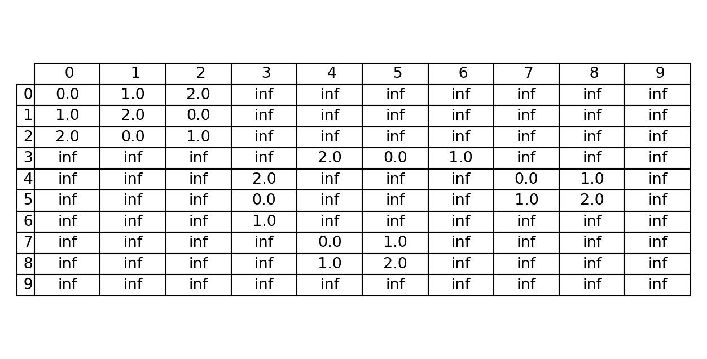
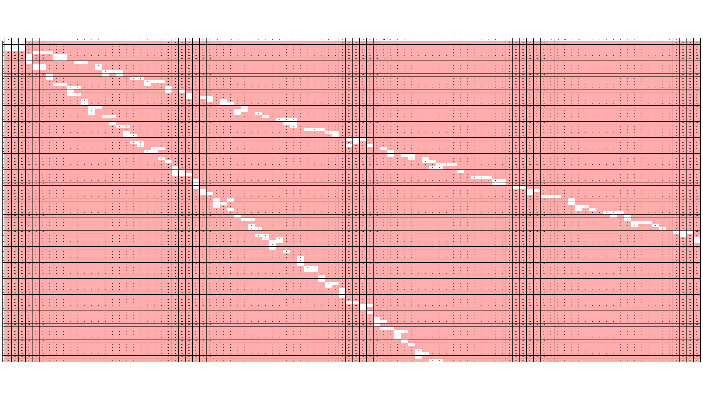

# やったこと
- n保持二ムのルーピーグランディ数を求めるプログラム
- n保持Wythoffの二ムのルーピーグランディ数を求めるプログラム(コードの再現が出来なかった)


# n保持二ムのルーピーグランディ数を求めるプログラム

## 原理
定理7.1.17(p.184)


$$
\begin{cases} x \oplus y & (x \oplus y \leq 2 \text{のとき}), \\ \infty(\{0, 1, 2\}) & (x \oplus y \geq 3 \text{のとき}) \end{cases}  
$$


を試して確認する


## プログラム

$ \infty(\{0, 1, 2\})$ として出力されるようにした

また、scvファイルで出力されるようにした

参考にしてたページ(https://jp-seemore.com/iot/24027/)

- ofstreamを使うことでstringの内容を出力ファイルにできる

```
#include <bits/stdc++.h>
using namespace std;

int main() {
    int n;    // XORした値の比較対象
    int w;    // 表のサイズ（範囲）
    string filename; // CSVファイル名を格納する変数

    int n;//n保持のn
    int w;//求めたい範囲w
    cout << "nを入力してください:";
    cin >> n;
    cout << "範囲を求めてください:";
    cin >> w;
    cout << "出力するCSVファイル名を入力してください (例: output.csv): ";
    cin >> filename;


    ofstream ofs(filename); // 入力されたファイル名でファイルを開く

    if (!ofs) {　// ファイルが開けなかった場合のエラー処理
        cout << "エラー: ファイル " << filename << " を開けませんでした。" << endl;
        return 1; // 異常終了
    }


    vector<vector<string>> g(w, vector<string>(w));
    for (int i = 0; i < w; i++) {
        for (int j = 0; j < w; j++) {
            int a = i ^ j;

            if (a < n) {
                g[i][j] = to_string(a);
            } else {
                g[i][j] = "inf";
            }

      
            ofs << g[i][j];
            if (j != w - 1) {
                ofs << ","; 
            }
        }
        ofs << endl; 
    }

  
    ofs.close(); //csvの終わり
    cout << "配列の内容を " << filename << " に出力しました。" << endl;

    return 0;
}

```
## 実行結果
```
0 1 2inf inf inf inf inf inf inf 
1 0 inf2 inf inf inf inf inf inf 
2 inf 01 inf inf inf inf inf inf 
inf 2 10 inf inf inf inf inf inf 
inf inf infinf 0 1 2 inf inf inf 
inf inf infinf 1 0 inf 2 inf inf 
inf inf infinf 2 inf 0 1 inf inf 
inf inf infinf inf 2 1 0 inf inf 
inf inf infinf inf inf inf inf 0 1 
inf inf infinf inf inf inf inf 1 0
```

100まで実装した


# n保持Wythoffの二ムのルーピーグランディ数を求めるプログラム

## 原理
定義7.1.9(p.178)

$$
G_{0}(G) =
\begin{cases}
0 & (G \text{が終了局面のとき}), \\
\infty & (\text{それ以外})
\end{cases}
$$

$$
G_{n+1}(G) =
\begin{cases}
m_n(G) & (G \text{の任意の選択肢 } G' \text{ で } G_n(G') > m_n(G) \text{ を} \\
& \text{満たすものについて, ある選択肢 } G'' \text{ が存在して} \\
& G_n(G'') = m_n(G) \text{ のとき}), \\
\infty & (\text{それ以外})
\end{cases}
$$


を使うことでグランディ数を求める

## 実行結果(3保持wythoff二ム)

```
0,1,2,inf,inf,inf,inf,inf,inf,inf
1,2,0,inf,inf,inf,inf,inf,inf,inf
2,0,1,inf,inf,inf,inf,inf,inf,inf
inf,inf,inf,inf,2,0,1,inf,inf,inf
inf,inf,inf,2,inf,inf,inf,0,1,inf
inf,inf,inf,0,inf,inf,inf,1,2,inf
inf,inf,inf,1,inf,inf,inf,inf,inf,inf
inf,inf,inf,inf,0,1,inf,inf,inf,inf
inf,inf,inf,inf,1,2,inf,inf,inf,inf
inf,inf,inf,inf,inf,inf,inf,inf,inf,inf

```



100まで回す
